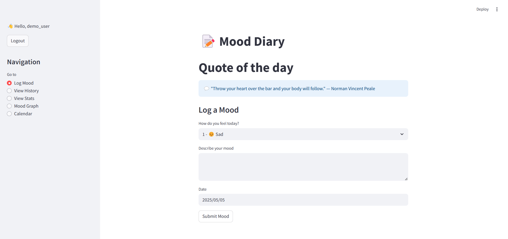
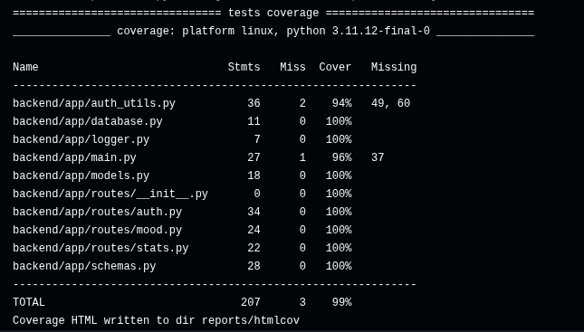

# Mood Diary Application

**Version:** 1.0.0

## 1. Overview

Mood Diary is a web application developed to help users maintain a personal electronic diary focused on tracking and understanding their emotional well-being. It allows users to securely log their daily mood using a simple scale, add descriptive notes, and visualize their mood history and trends over time.

The application features a Python-based backend using the **FastAPI** framework and **SQLAlchemy** for interactions with an **SQLite** database. The frontend is built with **Streamlit**, providing an interactive user interface. Project dependencies are handled by **Poetry**, and a Continuous Integration (CI) pipeline using **GitHub Actions** enforces automated quality checks.



## 2. Features

- **Secure User Authentication:** User registration and login via JWT tokens. Passwords are securely hashed using bcrypt.
- **Daily Mood Logging:** Record mood on a 0-4 scale (represented by emojis: 😔 Sad, 🙁 Low, 🙂 Neutral, 😊 Happy, 😄 Excited).
- **Descriptive Notes:** Add optional text notes to provide context for daily mood entries.
- **Mood History View:** View a chronologically sorted list of all past mood entries with their notes.
- **Statistical Analysis:** View aggregated statistics, including total entries, average mood score, best/worst mood days, and the most common mood.
- **Mood Trend Graph:** Visualize mood changes over the last 30 days on a line graph.
- **Interactive Mood Calendar:** View mood entries for a selected month displayed on a calendar using corresponding emojis.
- **Quote of the Day:** Displays a daily inspirational quote fetched from the [zenquotes.io](https://zenquotes.io/) external API.

## 3. Architecture

The application follows a decoupled frontend-backend architecture to promote modularity and maintainability.

- **Backend (`backend/` directory):**
  - **Framework:** FastAPI (Python 3.11)
  - **Database:** SQLite with SQLAlchemy ORM
  - **Data Validation:** Pydantic
  - **Authentication:** JSON Web Tokens (python-jose) & bcrypt (passlib)
  - **Modularity:** Code organized into distinct modules for routes (`auth`, `mood`, `stats`), database (`models.py`, `database.py`), data schemas (`schemas.py`), authentication utilities (`auth_utils.py`), and logging (`logger.py`).
  - **Logging:** Structured JSON logging implemented using Python's built-in `logging`.

- **Frontend (`frontend/` directory):**
  - **Framework:** Streamlit
  - **Backend Communication:** Uses the `requests` library for HTTP requests.

- **Testing (`tests/` directory):**
  - Static analysis, Unit/Integration, E2E/UI, Mutation, Fuzz, Stress/Performance tests are implemented using `pytest` and associated plugins.

- **Dependency Management:**
  - **Poetry:** Manages dependencies, virtual environments, and packaging.

## 4. Quality Assurance Report

This project emphasizes software quality, verified through various tools and testing methodologies integrated into an automated CI pipeline.

### 4.1 Maintainability

- **Modularity:** Achieved through the separation of concerns described in the Architecture section (FastAPI routers, distinct backend modules, frontend/backend split). Code review confirms logical separation.
- **Testability:** Backend code coverage exceeds **96%**, measured by `pytest-cov`. The CI pipeline enforces a minimum of 80% coverage. Key modules (`auth`, `mood`, `stats`, `schemas`, `models`) achieve 100% coverage.


- **Modifiability:** Code style adheres to PEP8, enforced by `flake8` checks within the CI pipeline. Code complexity is kept low (verified optionally via `radon`).

### 4.2 Reliability

- **Faultlessness (< 1 critical error/week):** Addressed proactively through comprehensive testing:
  - **Unit/Integration tests (`pytest`):** Verify individual components and their interactions.
  - **Fuzz Testing (`hypothesis`):** Tests API robustness against unexpected inputs.
  - **Mutation Testing (`mutmut`):** Verifies the quality of the test suite by checking if tests fail when code is subtly changed.
  - **Static Analysis (`bandit`):** Catches potential bugs and security issues early.
  - **UI testing (`selenium`):** Verifies end-to-end user workflows.
- **Input Validation:** Validation using `Pydantic` schemas (`schemas.py`) enforce strict data validation (mood range, string lengths, username format) at the API boundary, verified by fuzz testing.

### 4.3 Performance

- **Time Behaviour (< 2s response):** Verified using **Locust** load testing (`tests/perf_test_locust.py`). Key API endpoints consistently meet the performance target under simulated load.
- **Resource Utilization** Achieved through explicit database indexing (`models.py`) on key columns. Frontend caching (`@st.cache_data`) is used for the external quote API.

### 4.4 Security

- **Confidentiality (Password Storage):** Passwords are securely hashed using **bcrypt** via `passlib`.
- **Integrity (Attack Protection):**
  - *SQL Injection:* Prevented by the use of the `SQLAlchemy ORM`.
  - *XSS:* Mitigated by escaping user-provided notes (`html.escape`) in the frontend.
  - *Input Validation:* Handled by `Pydantic` and tested via fuzzing.
  - *Static Analysis:* `Bandit` scans are integrated into CI to detect common vulnerabilities.
- **Non-republication (Logging):** Key user actions are logged in a structured **JSON format** with relevant context (user details, timestamps).

### 4.5 CI/CD

- An automated **GitHub Actions** workflow (`.github/workflows/ci.yml`) enforces:
  - Linting (`ruff` & `flake8`)
  - Security Scanning (`bandit`)
  - Testing (`pytest` runs unit, integration, and fuzz tests; `mutmut` runs mutation test; `locust` runs performance tests)
  - Code Coverage Check (`pytest-cov`, minimum 80%)

## 5. Setup Instructions

1. **Prerequisites:**

   - Python 3.11+
   - Poetry
   - Git

2. **Clone:**

    ```bash
    git clone https://github.com/MoeJaafar/mood-diary.git
    ```

     ```bash
    cd mood-diary
    ```

3. **Install Dependencies:**

    ```bash
    poetry install
    ```

4. **Database:** SQLite files (`mood.db`, `test.db`) are created automatically on first run.

## 6. Usage Instructions

Run the backend and frontend in separate terminals from the project root.

1. **Run Backend API (Terminal 1):**

    ```bash
    poetry run uvicorn backend.app.main:app --reload --port 8000
    ```

    *(API at `http://localhost:8000`)*
2. **Run Frontend UI (Terminal 2):**

    ```bash
    poetry run streamlit run frontend/app.py
    ```

    *(UI typically at `http://localhost:8501`)*

## 7. API Documentation

Auto-generated interactive documentation is available when the backend is running:

- **Swagger UI:** `http://localhost:8000/docs`
- **ReDoc:** `http://localhost:8000/redoc`

## 8. Testing Commands

Run these commands from the project root directory:

- **All Tests (Unit, Integration, Fuzz):**

    ```bash
    poetry run pytest
    ```

- **Tests with Coverage Report:**

    ```bash
    poetry run pytest --cov=backend/app --cov-report term-missing
    ```

- **Linter (Style Check):**

    ```bash
    poetry run flake8 .
    ```

- **Security Scan:**
  
    ```bash
    poetry run bandit -r . -c pyproject.toml
    ```

- **Mutation Tests:**

    ```bash
    poetry run mutmut run
    poetry run mutmut results
    ```

- **Performance Tests (Backend must be running):**

    ```bash
    poetry run locust -f tests/perf_test_locust.py --headless --host=http://localhost:8000 -u 5 -r 2 -t 10s
    ```

- **UI End-to-End Tests (Backend & Frontend must be running; Selenium/WebDriver required):**

    ```bash
    poetry run pytest tests/test_ui_streamlit.py
    ```
